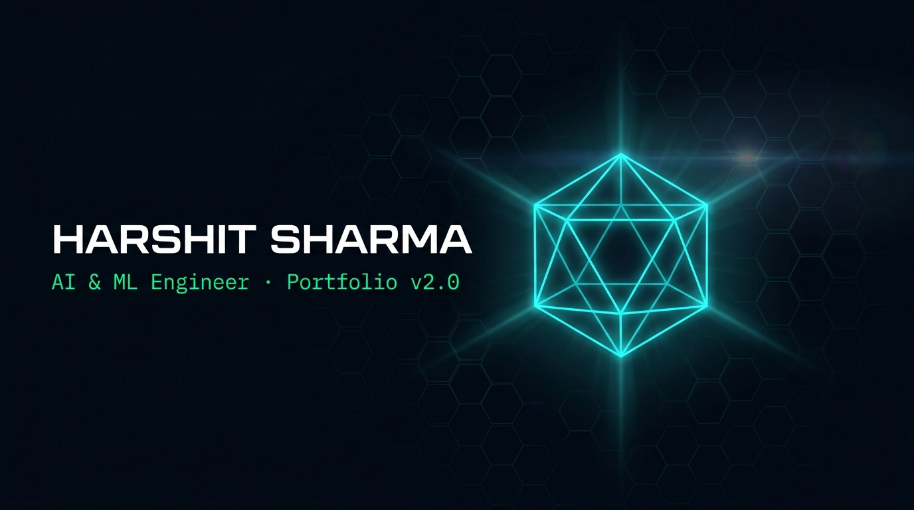

<div align="center">
  
</div>

<br/>

<div align="center">

[](https://react.dev)
[](https://vitejs.dev)
[](https://developer.mozilla.org/en-US/docs/Web/API/Canvas_API)
[](https://developer.mozilla.org/en-US/docs/Web/API/Web_Audio_API)
[](https://developer.mozilla.org/en-US/docs/Web/API/Web_Speech_API)
[](https://harshitthek.github.io/harshitfolio)

**A cinematic cyberpunk AI mission control command center — engineered like an operational military terminal, not a static webpage.**

[🌐 View Live Experience](https://harshitthek.github.io/harshitfolio) &nbsp;·&nbsp;
[💼 LinkedIn Profile](https://www.linkedin.com/in/devharshitsharma) &nbsp;·&nbsp;
[🐙 GitHub Repositories](https://github.com/harshitthek)

</div>

---

## ⚡ Transmission Overview

**HARSHIT.EXE** is an operational, next-generation multiverse developer interface. Designed as a fictional AI mission control command terminal, it immerses recruiters, engineers, and visitors in a cinematic experience while transmitting real-world production engineering work by **Harshit Sharma** — AI & Machine Learning engineer at USAR (GGSIPU), New Delhi.

Every component serves a purpose. Every animation is hardware-accelerated. Every interaction features procedural acoustic feedback.

---

## 🎮 Five-Stage Cinematic Journey

```
[ SCREEN 1: VIDEO HOLOGRAM ] ──> [ SCREEN 2: DECRYPTING LOADER ] ──> [ SCREEN 3: MISSION CONTROL ]
                                                                               │
                                                                               ▼
[ SCREEN 5: DEPLOYMENT MATRIX ] <── [ SCREEN 4: 13 MULTIVERSE PORTALS ] <──────┘
```

1. **Screen 1 — 3D Holographic Intro**: High-definition opening cinema with interactive audio handshake and fluid full-frame containment across all devices.
2. **Screen 2 — Quantum Decryption Loader**: Real-time telemetry feed with cycling hex hashes, tactile audio key ticks, and exit flash transition.
3. **Screen 3 — Classified Mission Control**: Centered around a 3D Quantum Wireframe Hologram, Pixar Luxo Jr. stomp physics on the name header, left autonomous telemetry terminal, and right quantum laboratory controls.
4. **Screen 4 — 13 Multiverse Portals**: 3D parallax cards representing production AI systems, autonomous agents, and ML models with live deployment triggers.
5. **Screen 5 — Dynamic Deployment Matrix**: High-speed hyperdrive redirect sequence into live project repositories and demos.

---

## 🌟 Flagship Features

### ⌨️ Cyber Command Palette (`Ctrl + K` / `Cmd + K` / `/`)
* **Instant Spotlight HUD**: Floating command matrix with fuzzy search indexing across all 13 projects, 8 modals, navigation routes, and audio controls.
* **Full Keyboard Accessibility**: Arrow key navigation (`↑` / `↓`), `Enter` execution, tactile synthesizer feedback, and mobile touch support.

### 🪐 Custom 3D Quantum Hologram (Zero External 3D Libraries)
* **Pure HTML5 Canvas 2D Engine**: 12-vertex icosahedron shell with 30 wireframe edges and 6-vertex inner core octahedron running locked at 60/120 FPS via procedural trigonometry without Three.js or WebGL dependencies.
* **Quantum Supernova BOOM**: Detonates a fullscreen 7.5× expansion blast wave with kinetic spark trails and smooth reassembly.

### 💡 Pixar Luxo Jr. Lamp Stomp Physics
* Articulated Jac Jacobsen L-1 flared bell shade with multi-stage keyframe physics.
* The lamp enters from above, bounces across the letters, stomps the letter **"I"** into a squashed pancake plate, inspects the impact, and swivels forward to project a volumetric spotlight beam.

### 🐍 Autonomous Terminal & Retro Cyber Snake Arcade
* **Linux Hacker Sandbox**: Autotyping live system logs, system architecture specs, and interactive terminal commands.
* **Playable Arcade Snake**: Touch swipe gestures, tactile D-Pad controls, dynamic score multiplier, and shimmering **Golden Glitch** bonus star orbs.

### 🧠 In-Browser Machine Learning Valuation Simulator
* Real-time client-side polynomial valuation engine estimating vehicle market value based on mileage, brand tier, condition chips, and age with animated confidence metrics.

### 🔊 Procedural Web Audio Synthesizer & AI Voice Engine
* **Web Audio API SoundFX Engine**: 100% procedural sound synthesis — sub-bass explosion drops, tactile chirps, laser ticks, and deploy chimes with zero external audio files.
* **AI Voice Transceiver**: Web Speech Synthesis API with Chromium GC freeze protection and keepalive heartbeats.

### ⚡ Free-Tier Backend Pre-Warmup Pipeline
* Silent parallel health-check ping on mount that wakes up sleeping Render/Railway/Fly.io backend containers in the background before the user navigates to the project demos.

---

## ⌨️ Global Hotkeys & Shortcuts Cheat Sheet

| Key Combination | Action Executed |
| :--- | :--- |
| **`Ctrl + K`** / **`Cmd + K`** | Open Cyber Command Palette Spotlight HUD |
| **`/`** | Quick search & command palette launcher |
| **`T`** | Open Cyber Terminal & Snake Arcade Game |
| **`M`** | Open Neural ML Valuation Simulator |
| **`C`** | Open Interactive Python Code Inspector |
| **`A`** | Open Multi-Agent Architecture Diagrams |
| **`D`** | Open Executive Personnel Dossier & Resume |
| **`1` – `9`, `0`** | Direct Launch Multiverse Project #1 through #10 |
| **`ESC`** | Close any active modal or command palette |

---

## 🛠️ Technology Stack

| Layer | Technology | Key Capabilities |
| :--- | :--- | :--- |
| **Framework** | React 18 + Vite 5 | Reactive state machine, fast HMR, and ultra-compact production bundle (< 115 kB gzip) |
| **3D Rendering** | HTML5 Canvas 2D API | Custom vector/matrix rotation engine, perspective projection, depth-sorted luminance |
| **Audio Engine** | Web Audio API | Procedural oscillator synthesis, frequency modulation, and zero audio file footprint |
| **Speech Engine** | Web Speech Synthesis API | AI narration with utterance garbage-collection protection |
| **Styling & FX** | Vanilla CSS3 (Custom Design System) | HSL tokens, backdrop blurs, CRT scanline raster, responsive bottom sheets |
| **Performance** | `requestAnimationFrame` + Batched Draws | Zero `shadowBlur` bottlenecks, squared Euclidean distance checks, locked 60/120 FPS |
| **Deployment** | GitHub Pages + Automated CI/CD | `npm run deploy` via `gh-pages` |

---

## 📂 Project Architecture

```
harshitfolio/
├── public/
│   ├── banner.jpg                  Cinematic HUD banner
│   ├── icon.svg                    Vector favicon
│   └── site.webmanifest            PWA installation manifest
│
├── src/
│   ├── App.jsx                     Master screen orchestrator & hotkey manager
│   ├── index.css                   Complete cyberpunk design tokens & responsive styles
│   │
│   ├── components/
│   │   ├── VideoScreen.jsx         Screen 1: Cinematic video hologram
│   │   ├── IntermediateScreen.jsx  Screen 2: Quantum decryption loader
│   │   ├── MissionScreen.jsx       Screen 3: Mission control hub
│   │   ├── CardsScreen.jsx         Screen 4: 13 Multiverse portal cards
│   │   ├── LoadingScreen.jsx       Screen 5: High-speed deployment sequence
│   │   │
│   │   ├── Navbar.jsx              Cyber top HUD nav (audio, voice, social, ⌘K)
│   │   ├── HologramCanvas.jsx      Custom 3D icosahedron quantum projection engine
│   │   ├── CyberTerminalWing.jsx   Autonomous autotyping telemetry stream
│   │   ├── QuantumLaboratoryWing.jsx Lab controller & Supernova BOOM trigger
│   │   ├── NeuralBackground.jsx    Batched 60fps synaptic particle network
│   │   ├── CyberCursor.jsx         Dual-layer trailing laser reticle
│   │   │
│   │   ├── VoiceContext.jsx        AI voice synthesis state & keepalive engine
│   │   ├── SoundFX.js              Web Audio API procedural sound synthesizer
│   │   │
│   │   └── modals/
│   │       ├── CommandPaletteModal.jsx  Ctrl+K Spotlight HUD search engine
│   │       ├── TerminalModal.jsx        Interactive Linux terminal & Snake arcade
│   │       ├── MLSimulatorModal.jsx     Live machine learning inference sandbox
│   │       ├── CodeInspectorModal.jsx   Python AST & production code viewer
│   │       ├── ArchitectureModal.jsx    Full-stack system blueprints
│   │       ├── DossierModal.jsx         Executive resume & experience log
│   │       └── ContactModal.jsx         Direct COMMS transmission portal
│   │
│   ├── data/
│   │   └── projectsData.js         Production project catalog & metadata
│   │
│   └── utils/
│       └── backendWarmup.js        Asynchronous backend warmup triggers
│
├── index.html                      SEO metadata, OpenGraph, PWA headers
├── package.json                    Dependencies and deployment scripts
└── vite.config.js                  Vite production bundle configuration
```

---

## 🚀 Local Development Setup

```bash
# 1. Clone the repository
git clone https://github.com/harshitthek/harshitfolio.git

# 2. Enter project directory
cd harshitfolio

# 3. Install dependencies
npm install

# 4. Start local development server
npm run dev
```

Visit `http://localhost:5173` in your browser. (Chrome, Edge, or Firefox recommended for optimal Web Audio and Canvas performance).

---

## 👨‍💻 Engineering Identity

<div align="center">

**Harshit Sharma**  
*AI & Machine Learning Student | USAR (GGSIPU), New Delhi*  
*Specializing in Agentic Workflows, Machine Learning Engines, and Real-Time Systems*

📧 [codewithharshitsharma@gmail.com](mailto:codewithharshitsharma@gmail.com) &nbsp;·&nbsp;
💼 [LinkedIn](https://www.linkedin.com/in/devharshitsharma) &nbsp;·&nbsp;
🐙 [GitHub @harshitthek](https://github.com/harshitthek)

<br/>

```
[ SYSTEM_ONLINE // 13 UNIVERSES ACTIVE // ALL CHANNELS NOMINAL ]
```

</div>
